# Pokémon Battle Game
### Game in Pokémon world based on a popular "Rock-Scissor-Paper" rules.
#### (Developer: Mateusz Smalarz aka [YatechDev](https://github.com/YatechDev))

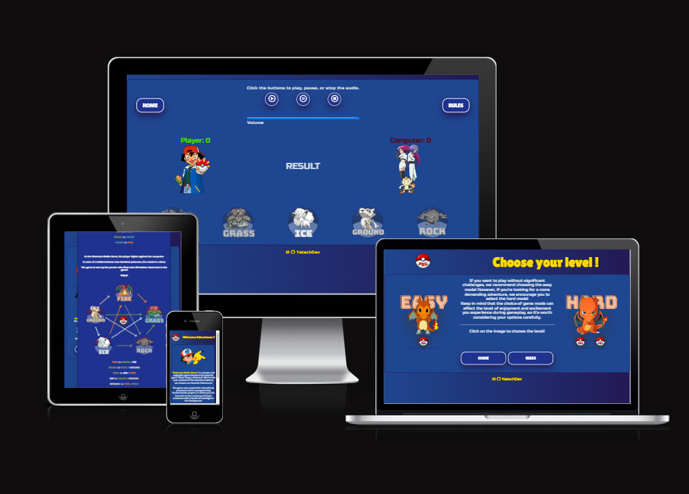

[Pokemon Battle Game - Live webpage](https://yatechdev.github.io/CI_PP2_Pokemon_Battle_Game/index.html) (Right click to
open in new tab)

My second portfolio project for Code Institute where I study for a diploma - LVL 5 in Full Stack Software Development.

The aim of this project is to demonstrate skills in HTML, CSS and JavaScript and only these languages were used in the
development. No frameworks or other languages have been used apart from the parts used to Code Institute Template.

The website is responsive to lower screen resolutions, tablets and mobile phones.
It is also compatible with all popular web browsers.

The website is divided into subpages, but all of them are consistent, simple and pleasant to navigate.
It contains easy & fun to view elements and all the necessary information, such as the game rules & author details.

## Table of Content

1. [Project Goals](#project-goals)
    1. [User Goals](#user-goals)
    2. [Site Owner Goals](#site-owner-goals)
2. [User Experience](#user-experience)
    1. [Target Audience](#target-audience)
    2. [User Requirements and Expectations](#user-requirements-and-expectations)
    3. [User Stories](#user-stories)
3. [Design](#design)
4. [Technologies Used](#technologies-used)
    1. [Languages](#languages)
    2. [Frameworks & Tools](#frameworks-&-tools)
5. [Validation](#validation)
    3. [HTML Validation](#HTML-validation)
    4. [CSS Validation](#CSS-validation)
6. [Testing](#testing)
    5. [Accessibility](#accessibility)
    6. [Performance](#performance)
    7. [Device testing](#performing-tests-on-various-devices)
    8. [Browser compatibility](#browser-compatability)
7. [Bugs](#Bugs)
8. [Deployment](#deployment)
9. [Credits](#credits)
10. [Acknowledgements](#acknowledgements)

## Project Goals

The aim of this project is to create an interactive game based on the classic "Rock, Paper, Scissors" game, set in the
world of Pokémon. The game will have uncomplicated rules and two levels of difficulty to allow for both relaxing
gameplay and challenges for more advanced players. The game interface will be easy to use, intuitive, and provide fast
gameplay.

### User Goals
- A player can play a simple and short game that has uncomplicated rules.
- A player can try to play one of the most popular games set in the world of Pokémon.
- A player can reminisce about their childhood and feel a wave of nostalgia.
- A player can challenge a computer opponent in a game that has rules known to everyone.
- A player can play on various devices.

### Site Owner Goals
- Creating an interactive game that has the potential to attract various types of players as well as Pokemon fans.
- The game will be fast-paced and have simple rules.
- Navigation on the website will be easy and intuitive.
- The game will contain different levels of difficulty.
- The game will be responsive and look nice on various devices such as computers, tablets, and mobile phones.

## User Experience

### Target Audience
The target audience for this game is broad and includes both casual gamers and Pokemon fans. The simplicity of the game
and easy-to-use interface makes it accessible to a wide range of ages, including children and adults. It will appeal to
those who enjoy fast-paced games with uncomplicated rules and challenges. The Pokemon theme adds an additional layer of
appeal for fans of the franchise.

### User Requirements and Expectations

Users who play this game expect a simple and short gameplay experience with uncomplicated rules. They also expect a
responsive and intuitive interface that allows for fast-paced gameplay. Players who are Pokemon fans will appreciate the
incorporation of the franchise's theme into the game. Additionally, users expect different levels of difficulty that can
cater to both novice and experienced players. They also expect the game to be playable on various devices, such as
computers, tablets, and mobile phones. Overall, users want an enjoyable and accessible game that provides a nostalgic
experience while also offering a new twist on the classic "Rock, Paper, Scissors" game.

### User Stories

#### First-time users
- As a first-time user, I want to understand the game rules quickly and easily so that I can start playing without any
  confusion.
- As a first-time user, I want the game interface to be intuitive and responsive, so I can easily navigate and play the
  game.
- As a first-time user, I want the game to have clear instructions and different levels of difficulty, so I can choose a
  level that suits my skill level.

#### Returning visitor
- As a returning user, I want the game to have a variety of computer opponents, each with different strategies and skill
  levels, so that the game remains challenging and engaging.
- As a returning user, I want the game to offer rewards or achievements for completing challenges or reaching certain
  milestones, so that I have a sense of progress and accomplishment.

[Back to top &uarr;](#Pokémon-Battle-Game)

## Design
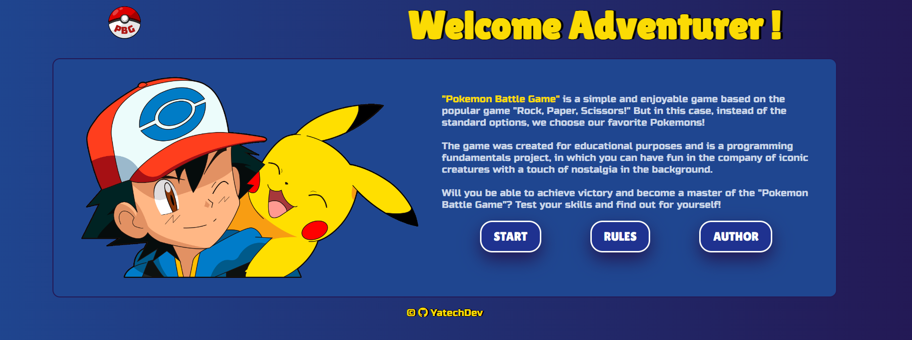

The design of the game is intuitive, responsive, and visually appealing to our target audience. I wanted the game
interface to be user-friendly, with clear instructions and simple navigation, so that players can quickly understand the
rules and start playing without any confusion. The game is designed to be responsive and optimized for different
devices, such as computers, tablets, and mobile phones, ensuring accessibility for all players.

To create a nostalgic and familiar experience for Pokémon fans, we incorporated elements of the franchise, such as
colors, characters, and logos, into the visual design. I also added different levels of difficulty, which are
represented through unique character designs and backgrounds, providing players with a sense of difficulty and
accomplishment.

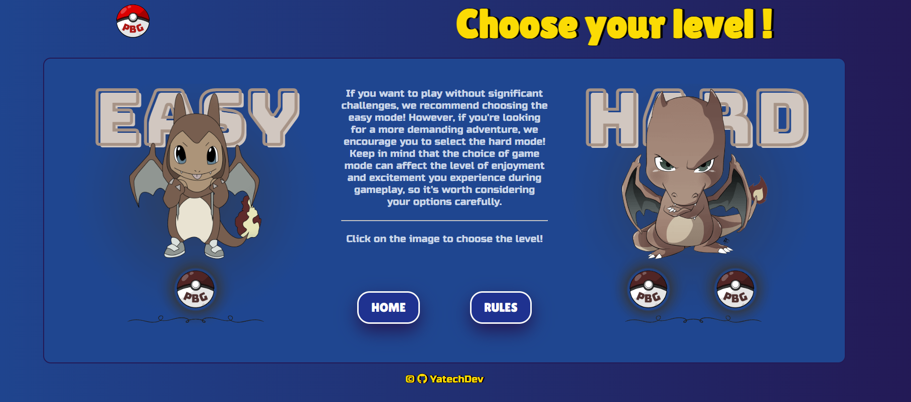
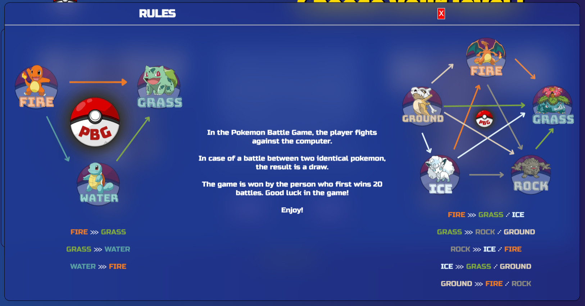

I wanted the game to be visually engaging and fast-paced to keep players interested and entertained throughout the
gameplay experience. I am not a designer but still I worked hard to create a fun and enjoyable experience for players,
while also remaining true to our project goals and target audience. Overall, the design of our game is tailored to 
provide a satisfying and immersive gaming experience for players of all ages and skill levels.

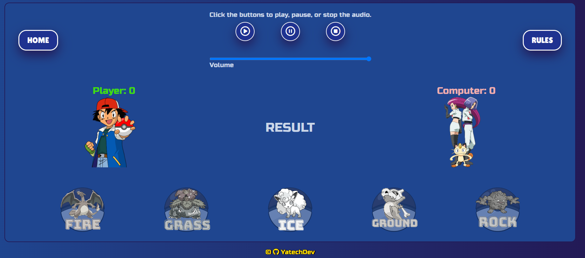

[Back to top &uarr;](#Pokémon-Battle-Game)

## Technologies Used

### Languages
- HTML 5
- CSS 3
- JavaScript

### Frameworks & Tools
- [Balsamiq](https://balsamiq.com/) (create wireframes for the project)
- [GitHub](https://github.com/) (create, hold and deploy repository)
- [Git](https://git-scm.com/) (source code management)
- [WebStorm](https://www.jetbrains.com/webstorm/) (IDE use to build the website)
- [Chrome DevTools](https://developer.chrome.com/docs/devtools/) (checking & testing the site)
- [W3C HTML Validator](https://validator.w3.org/) (validation of HTML code)
- [W3C JigSaw Validator](https://jigsaw.w3.org/css-validator/) (validation of CSS code)
- [JSHint](https://jshint.com/) (validation of JavaScript code)
- [Webaim](https://wave.webaim.org/) (accessibility & contrast checker)
- [Am I Responsive](https://ui.dev/amiresponsive) (website mockup)
- [Canva](https://www.canva.com/) (images edit, logo & other graphic elements)
- [Paint](https://www.getpaint.net/index.html) (images edit)
- [Freeconvert](https://www.freeconvert.com/jpg-to-webp) (convert jpg to webp format)
- [TinyPNG](https://tinypng.com/) (compress images)
- [Google Fonts](https://fonts.google.com/) (fonts)
- [Font Awesome](https://fontawesome.com/) (icons)
- [Favicon.io](https://favicon.io/) (favicon)
- [Evernote](https://evernote.com/) (notes, screenshots)
- [Grammarly](https://www.grammarly.com/) (typography)

[Back to top &uarr;](#Pokémon-Battle-Game)

## Validation

### HTML Validation 
I used "W3C Markup Validation Service" to validate the code. 
I validated each of the subpages and no error was found on any of them.

Home ✅

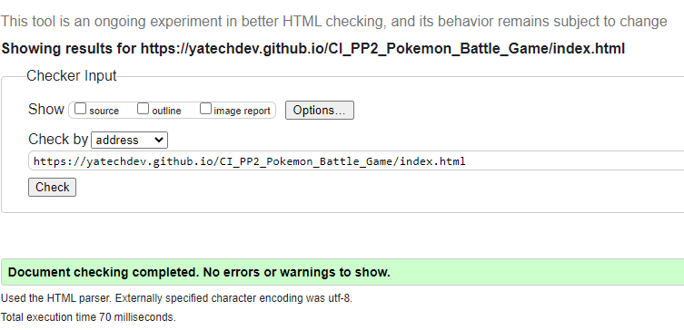

Game Levels ✅

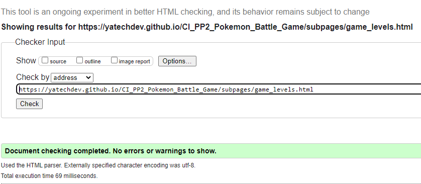

Easy Game Mode ✅

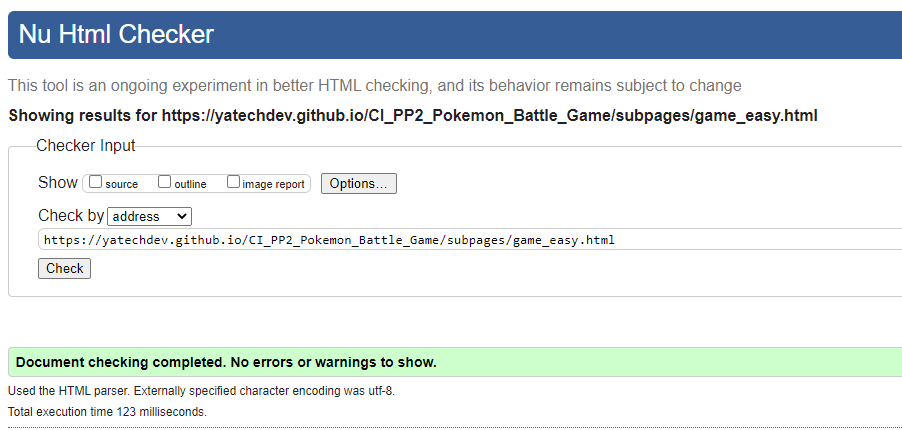

Hard Game Mode ✅

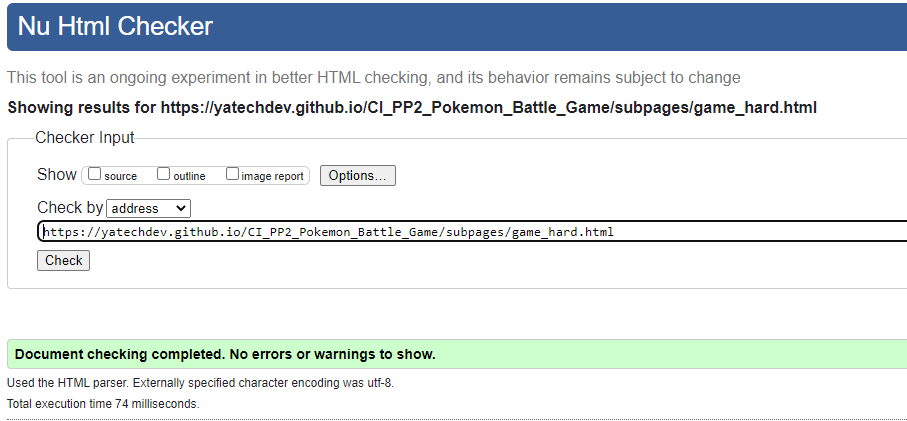

404 ✅

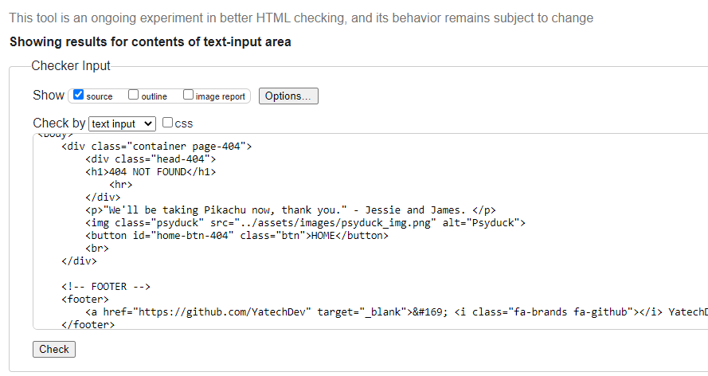

### CSS Validation
I used "W3C CSS Validation Service" to validate the CSS code.
No error was found.

CSS ✅

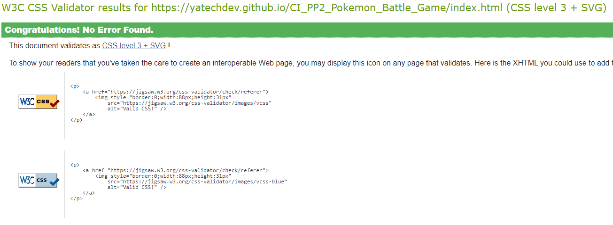

### JavaScript Validation
I used "JSHint" to validate the code.
I validated each of the three files and no error was found on any of them.

Main js ✅

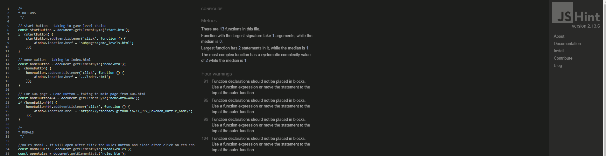

Easy Game Mode js ✅

Hard Game Mode js ✅

[Back to top &uarr;](#Pokémon-Battle-Game)

## Testing

### Accessibility
I used "The WAVE WebAIM web accessibility evaluation tool" to test the code for accessibility and there is no errors
across the website.

Home ✅

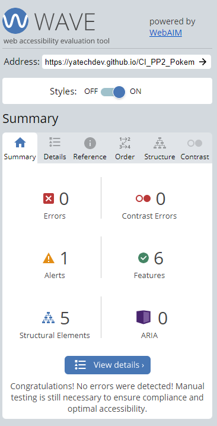

Game Levels ✅

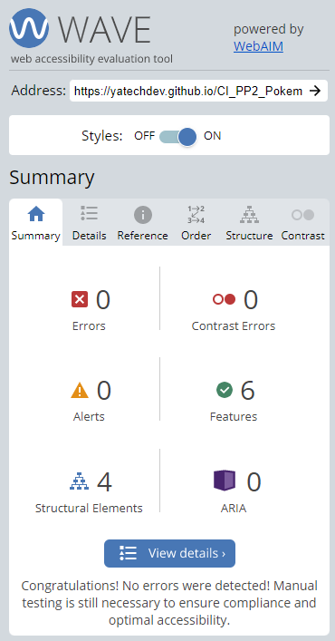

Easy Game Mode ✅

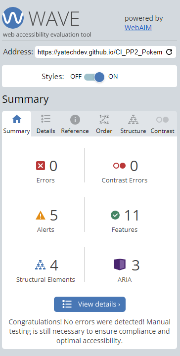

Hard Game Mode ✅

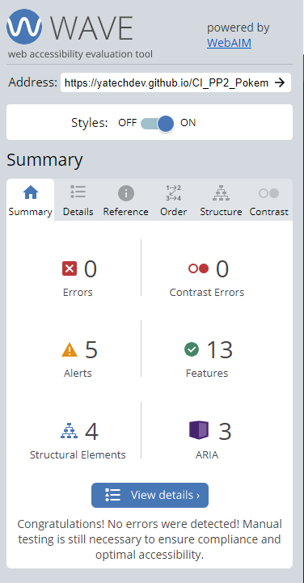

404 ✅

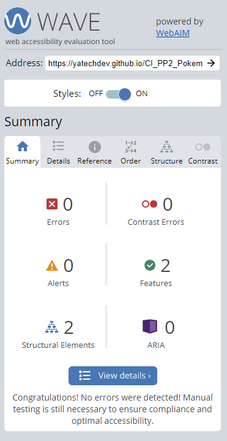

### Performance

To test the performance on the website, I used Google Lighthouse in Google Chrome Developer Tools.
The test was carried out on index.html and all subpages. 
Below is a list of screenshots:

Home

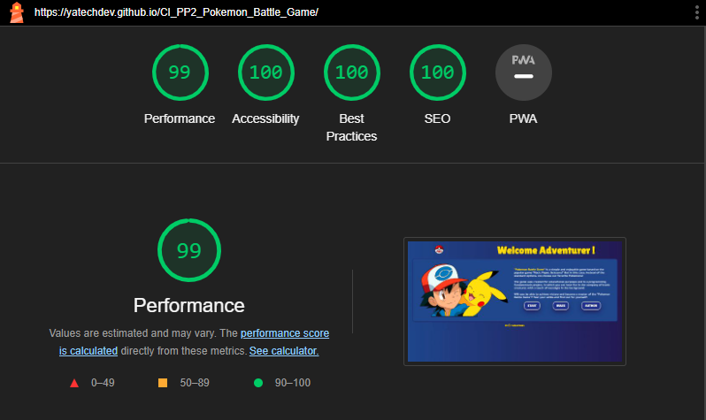

Game Levels

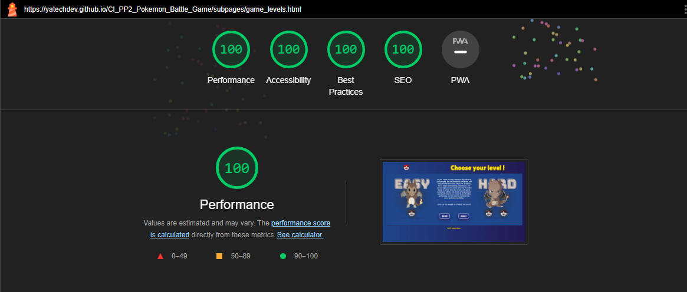

About

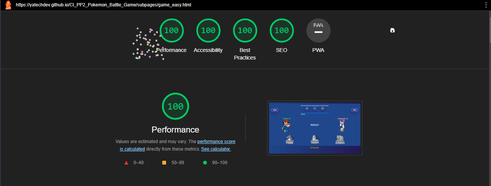

About - mobiles

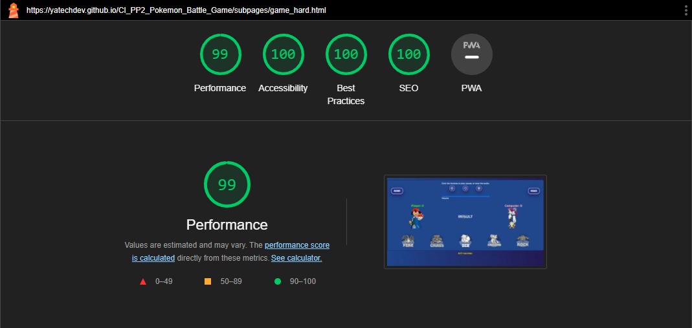

Menu

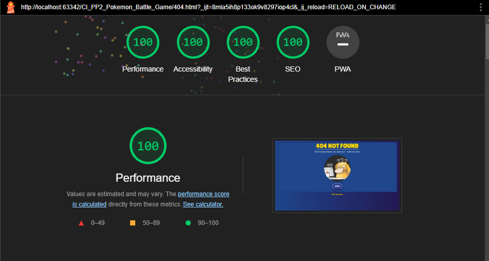

### Performing tests on various devices
Laptops
- MSI Katana GF76 17.3" ✅
- ASUS TUF Dash F15 15.6" ✅
- ASUS E210MA 11.6" ✅

Apple mobiles
- iPhone 14 PRO ✅
- iPhone 11 PRO ✅
- iPhone XR ✅

Android devices
- Xiaomi Redmi Note 9 ✅
- Samsung A51 ✅
- Samsung Galaxy Tab A (landscape & portrait mode) ✅

### Browser compatability
The website has been tested on the following browsers:
- Google Chrome ✅
- Chromium ✅
- Mozilla Firefox ✅
- Opera ✅
- Microsoft Edge ✅
- Safari ✅
- Samsung Internet Browser  ✅

[Back to top &uarr;](#Pokémon-Battle-Game)

## Bugs

| **Bug**                                              | **Fix**                                        | **Result** |
|------------------------------------------------------|------------------------------------------------|------------|
| Music in audio element not working on iPhone devices | Add another formats and correct the attributes | Fixed      |
| Anchor element place inside of button                | Use JavaScript click event for button          | Fixed      |
| Contrast check failed on game area                   | Change computer score color                    | Fixed      |
| Wrond path to assets from subpages                   | Corrected path to the files                    | Fixed      |
| Button Play Again didn't work in end game modal      | Corrected Element's ID in js code              | Fixed      |

## Deployment
The website was deployed on GitHub by using following steps:
1. Login into GitHub and locate the repository - [CI_PP2_Pokemon_Battle_Game](https://github.com/YatechDev/CI_PP2_Pokemon_Battle_Game)
2. At the top of repository locate the "settings" button and click on it.
3. Now on the left sidebar find locate the "pages" button and click on it.
4. Under source heading click on the branch dropdown menu and select: master.
5. Click save.
6. You will receive link to your deployed repository like on the screen below.

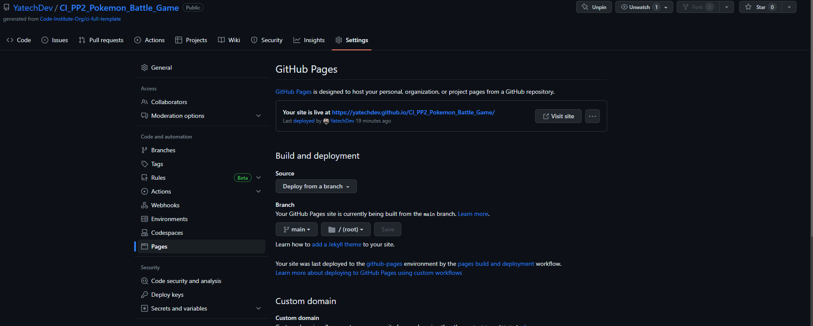

Forking the GitHub repository:
1. Login into GitHub and locate the repository - [CI_PP2_Pokemon_Battle_Game](https://github.com/YatechDev/CI_PP2_Pokemon_Battle_Game)
2. At the top of repository in right corner locate the "fork" button and click on it.
3. Choose where you want to save your forked repository.

## Credits

1. [CI TEMPLATE](https://github.com/Code-Institute-Org/gitpod-full-template) - This repository was created using the
   template proposed by Code Institute
2. [Canva](https://www.canva.com/) - All photos and graphics are from Canva and are used under a license I have. I made
   most of the graphic elements myself using this program.
3. [JetBrains](https://www.jetbrains.com/webstorm/) - I use their software - WebStorm - as my main IDE.
4. [Code Institute](https://codeinstitute.net/) - As the main source of my knowledge.
5. [Jak zaczac programowac](https://jakzaczacprogramowac.pl/) - Polish youtube channel and discord group with a lot of
   resources & tips.
6. [W3Schools](https://www.w3schools.com/), [DailyDev](https://daily.dev/) -
   As additional places where I often do additional courses or read articles and enrich my knowledge.

## Acknowledgements
- To My amazing wife Karolina, who supported me during the whole process of learning and creating the project, allowed
  me to focus on my work and keep me motivated to act all the time.
- To my family and friends - for being a great support and for their motivation.
- The entire Code Institute community on slack for great understanding and motivation every day!

[Back to top &uarr;](#Pokémon-Battle-Game)

